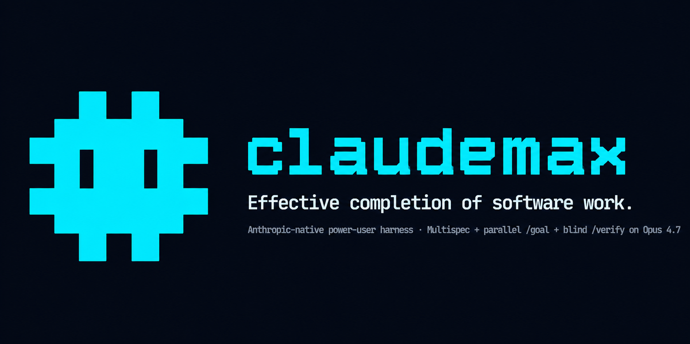

<p align="center">
  
</p>

<h1 align="center">claudemax</h1>

<p align="center">
  <strong>Anthropic-native power-user harness for effective completion of software work, no matter how big the task is.</strong><br>
  Spec-driven · multispec · max-parallel · validated-loop autonomy · independently verified · Claude Max first-class.
</p>

---

## Ask. Achieve.

```bash
cmax ask "migrate the auth layer to passkeys with passing tests end-to-end"
```

One command. The pipeline runs:
**`/deepresearch`** (web-current, sourced) → **multispec decompose** (Opus authors N sub-Specs + DAG) → **`/specqa`** (mechanically-checkable verifyHints) → **`/introspect`** (confidence + assumption hard-gate) → **parallel `/goal`** per DAG leaf (Mode A SDK subagents or Mode B Claude Code Agent Teams, auto-selected) → **per-sub-Spec `/verify`** (blind Opus) → **rollup `/verify`** (blind Opus against integration conditions). Bundled [dark-patterns hooks](https://github.com/waitdeadai/llm-dark-patterns) (35 of them) block vibes, fake citations, aggregator hallucination, and credential leaks throughout.

Power-user flags live on `cmax run` (same engine; `cmax ask` is the friendly entry point):

```bash
cmax run "<goal>" --variant opusolo    # all-Opus for novel/security/auth work
cmax run "<goal>" --mode teams         # force Claude Code Agent Teams (Mode B) parallelism
cmax run "<goal>" --no-research        # skip /deepresearch for simpler goals
```

## ICP

**Claude Max users** — both **Max 5x** ($100/mo Agent SDK credit) and **Max 20x** ($200/mo) are first-class equals. Defaults tuned for Max, not Pro or API-key. Plan auto-detected via `cmax doctor`. No tier selection at install.

## Philosophy

**Effectiveness is the ceiling. Cost-guard only protects the monthly Max credit envelope.**

Inherited from [minmaxing](https://github.com/waitdeadai/minmaxing), sharpened for the Anthropic-only world and the Claude Code 2.1.139 `/goal` era:

1. **Spec before goal.** Every autonomous run starts with a multispec — measurable completion conditions with mechanically-checkable verifyHints. `/goal` without a SPEC is a credit card on fire.
2. **Multispec as default.** Decompose big goals into 2–12 verifiable sub-Specs with a DAG. Parallel `/goal` per leaf. Rollup verify catches "all sub-Specs pass but integration fails."
3. **Route by intent, not vibes.** Opus for plan/spec/verify/architect/debug-hard. Sonnet for routine implementation. Haiku for search/classify. Escalate on novelty/security/prior-failure. Demote when monthly credit > 70/90/95%, never `/verify` or `/spec` or `/architect`.
4. **Max parallel by default.** Hardware + credit-aware cap. Two modes auto-selected: SDK subagents (Mode A) for ≤5 sub-Specs / short runs, Claude Code Agent Teams (Mode B) for big multi-day swarms with shared task list + worktree isolation.
5. **Independent verification.** Blind Opus session re-reads the repo and re-checks every completion condition. The verifier did not do the implementation — that's the point.

## Daily-driver umbrellas (4)

All four auto-run the full pipeline. They differ only in sub-Spec /goal exec tier:

| Umbrella | Plan/judge | Sub-Spec /goal exec | Verify | When |
|---|---|---|---|---|
| `/cmax` | Opus | **Sonnet** | Opus | Default |
| `/workflow` | Opus | Sonnet | Opus | v1 muscle memory alias |
| `/opussonnet` | Opus | Sonnet | Opus | v1 muscle memory; same as /cmax |
| `/opusolo` | Opus | **Opus** | Opus | Max effectiveness; auth/payments/novel-domain |

## Install

### Local install (recommended — Mac / Linux / WSL)

```bash
curl -fsSL https://raw.githubusercontent.com/waitdeadai/claudemax/main/install.sh | bash
```

Slim. No `tmux`, no `qrencode`, no `Tailscale`, no `NTFY` topic. Just: clone to `~/.claudemax`, `pnpm install && pnpm build`, symlink `cmax` to `~/.local/bin/`, bundle `llm-dark-patterns`, run `cmax doctor`. Use `--global` to symlink to `/usr/local/bin/` instead.

### Local install (Windows / PowerShell 5.1+)

```powershell
irm https://raw.githubusercontent.com/waitdeadai/claudemax/main/install.ps1 | iex
```

Clones to `$env:USERPROFILE\.claudemax`, builds, writes `cmax.cmd` + `claudemax.cmd` + `cmax.ps1` shims to `$env:USERPROFILE\.claudemax-bin`, adds that dir to your USER PATH, runs `cmax doctor`. Use `-Global` to install shims to `$env:ProgramFiles\claudemax` instead (needs admin).

### Power-user defaults baked into both installers

| default | value | why |
|---|---|---|
| `permissionMode` | `bypassPermissions` | equivalent to Claude Code's `--dangerously-skip-permissions`; goal-loop / TDD / multispec all run autonomously without per-edit prompts. Override per-invocation with `--permission default` if you want approval prompts back. |
| `effort` | `xhigh` | Anthropic's recommended max-effort tier for Opus 4.7 |
| plan / judge / verify | Opus 4.7 | never demoted, regardless of credit % or `--cheap` |
| sub-Spec exec | Sonnet 4.6 | router can escalate to Opus per task on novelty / security / complexity ≥ 7 |

### Remote-from-phone install (one command, full ceremony)

```bash
curl -fsSL https://raw.githubusercontent.com/waitdeadai/claudemax/main/setup.sh | bash
```

This is the legacy installer for the **"main mode while away from the computer"** flow. It auto-installs `tmux`, `qrencode`, `Tailscale` (via apt/brew/dnf/pacman with sudo confirms), generates `NTFY_TOPIC`, prints phone-side QR codes, then does everything `install.sh` does. Only use this if you actually want to drive claudemax from your phone over SSH.

### Behind a corporate proxy

If `curl` or `irm` can't reach `raw.githubusercontent.com`, configure your proxy before running the installer:

```bash
# Mac / Linux / WSL
export HTTPS_PROXY="http://your-proxy:8080"
export HTTP_PROXY="$HTTPS_PROXY"
git config --global http.proxy "$HTTPS_PROXY"
```

```powershell
# Windows
$env:HTTPS_PROXY = "http://your-proxy:8080"
$env:HTTP_PROXY  = $env:HTTPS_PROXY
git config --global http.proxy $env:HTTPS_PROXY
```

### Verified install (recommended for any curl-pipe-bash)

```bash
# install.sh (Mac / Linux / WSL slim installer)
curl -fsSL https://raw.githubusercontent.com/waitdeadai/claudemax/main/install.sh -o install.sh
curl -fsSL https://raw.githubusercontent.com/waitdeadai/claudemax/main/install.sh.sha256 -o install.sh.sha256
sha256sum -c install.sh.sha256          # or: shasum -a 256 -c install.sh.sha256
bash install.sh

# setup.sh (legacy full-ceremony installer for remote-from-phone flow)
curl -fsSL https://raw.githubusercontent.com/waitdeadai/claudemax/main/setup.sh -o setup.sh
curl -fsSL https://raw.githubusercontent.com/waitdeadai/claudemax/main/setup.sh.sha256 -o setup.sh.sha256
sha256sum -c setup.sh.sha256
bash setup.sh
```

```powershell
# install.ps1 (Windows slim installer)
irm https://raw.githubusercontent.com/waitdeadai/claudemax/main/install.ps1 -OutFile install.ps1
irm https://raw.githubusercontent.com/waitdeadai/claudemax/main/install.ps1.sha256 -OutFile install.ps1.sha256
Get-FileHash install.ps1 -Algorithm SHA256 | Format-List
# Compare the hash above to install.ps1.sha256 contents (first 64 chars), then:
.\install.ps1
```

### Update existing install (one command)

```bash
cmax update
```

`git pull --ff-only` + `pnpm install` + `pnpm build` + `cmax doctor`. Auto-detects the install dir from `~/.claudemax-state/config.json` (written by `setup.sh`), or walks up from the binary, or falls back to `~/.claudemax`. `--install-dir <path>` to override. `--dry-run` to preview.

### Per-project initialisation (existing project)

```bash
cd my-project
cmax init                      # writes .claude/skills/* + .claude/hooks/* + bundled llm-dark-patterns + .claudemax/plan-detection.json + .claude/settings.json
```

`--force` overwrites existing. `--no-dark-patterns` skips the bundle. `--target <path>` for non-cwd.

### Manual install (advanced)

```bash
git clone https://github.com/waitdeadai/claudemax ~/.claudemax
cd ~/.claudemax
pnpm install && pnpm build
pnpm dark-patterns:sync        # clones vendor/llm-dark-patterns
sudo ln -sf "$PWD/packages/cli/dist/index.js" /usr/local/bin/cmax
cmax doctor
```

## Billing (verified 2026-05-20)

Anthropic split Claude subscription billing on **June 15, 2026** into two pools:

| Surface | Bills against |
|---|---|
| `claude` interactive | Subscription interactive pool (Claude.ai shared; 5h rolling window) |
| `claude -p` / Agent SDK `query()` | **Separate monthly Agent SDK credit pool** ($100 Max5x / $200 Max20x) |
| `@anthropic-ai/sdk` w/ API key | Pay-per-token |

claudemax v0.2 routes 100% of provider calls through `query()` → bills against your Agent SDK credit. The spec writer was the last hold-out in v0.1; fixed.

## Dark-patterns hooks integrated

claudemax dogfoods the [waitdeadai/llm-dark-patterns](https://github.com/waitdeadai/llm-dark-patterns) plugin (35 hooks: no-vibes, no-emoji-spam, no-aggregator-hallucination, no-silent-worker-success, no-credential-leak-in-handoff, no-fake-cite, etc.). Install:

```bash
claude plugin marketplace add waitdeadai/claude-plugins
claude plugin install llm-dark-patterns@waitdeadai-plugins
```

See `.claude/DARK_PATTERNS_INSTALL.md` for the full inventory and standalone install paths.

## CLI

```bash
cmax ask "<goal>"                          # canonical ask-and-achieve entry; same engine as `cmax run`
cmax run "<goal>"                          # full multispec pipeline (default umbrella)
cmax run "<goal>" --variant opusolo        # all-Opus mode
cmax run "<goal>" --mode teams             # force Agent Teams (Mode B) parallelism
cmax run "<goal>" --tdd                    # enforce write-failing-test-first per sub-Spec where a test verifyHint exists
cmax run "<goal>" --confidence 0.85        # verifier confidence threshold for primary findings

cmax doctor                                # billing/auth/parallel/plan
cmax taste init                            # auto-bootstrap taste.md + taste.vision via /deepresearch
cmax overnight SPEC.md --budget-credits 50 # long-running w/ checkpoint resume
cmax research "<topic>"                    # /deepresearch with source ledger

cmax spec "<goal>"                         # single SPEC.md (no multispec)
cmax goal SPEC.md                          # /goal loop on existing SPEC.md
cmax tdd SPEC.md                           # strict test-first cycle (write failing test → implement → verify)
cmax verify SPEC.md --confidence 0.85      # blind Opus verify pass
cmax dispatch <plan.json>                  # low-level parallel packet fan-out
cmax route "<task>" --complexity 6         # inspect router decision

cmax memory search "<query>"               # FTS5 search across memory
cmax memory runs --limit 20                # recent runs
cmax memory credit                         # current-period credit consumption

cmax config get/set/list/path              # project config
cmax bg setup/status/kill/phone            # tmux + Tailscale + ntfy + phone QR onboarding (remote flow)
cmax update                                # git pull + pnpm install + pnpm build + cmax doctor

cmax init                                  # install skills + hooks into a project
```

## Docs

- [Architecture](./docs/ARCHITECTURE.md)
- [Multispec pipeline](./docs/MULTISPEC.md)
- [Parallelism (Mode A vs Mode B)](./docs/PARALLELISM.md)
- [Agent Teams (Mode B deep-dive)](./docs/AGENT_TEAMS.md)
- [Model routing](./docs/MODEL_ROUTING.md)
- [Goal pipeline](./docs/GOAL_PIPELINE.md)
- [Workflow variants](./docs/WORKFLOW_VARIANTS.md)
- [Skill catalog (29 active + 1 deprecated stub)](./docs/SKILL_CATALOG.md)
- [Taste auto-bootstrap](./docs/TASTE_AUTOBOOTSTRAP.md)
- [v1 → v2 migration](./docs/V1_TO_V2_MIGRATION.md)
- [Quickstart](./docs/QUICKSTART.md)

## What this is not

- Not a multi-provider abstraction. Anthropic-only by design. Want MiniMax? Use [minmaxing v1](https://github.com/waitdeadai/minmaxing).
- Not "throw Opus at everything." Effectiveness max, cost-aware.
- Not autonomous-without-spec. `/goal` without a SPEC is a credit card on fire.
- Not for Pro-tier users (we support it; just not tuned for it).

## License

Apache-2.0. See [LICENSE](./LICENSE).
